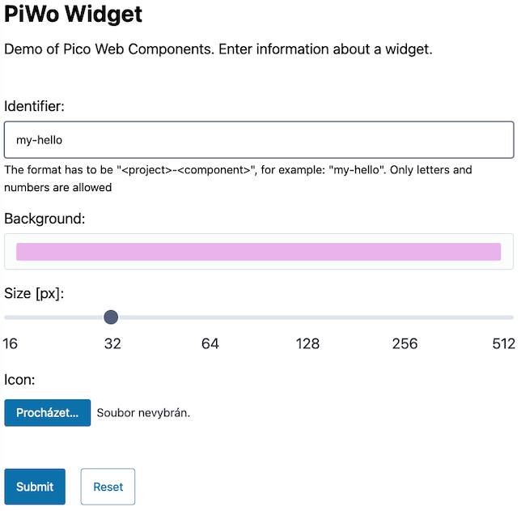

# Pico Web Components

Experimental web components. A demonstration of the technology rather than a library for building applications. But that may change :-)

* Low-level. Granularity of native elements for fully flexible layouts and combinations with the native elements.
* Tiny. Avoid dependencies on heavy frameworks when writing small web components.
* Integrated. Usable interchangeably with the native HTML elements by providing the same interface.
* Accessible. Support assistive technologies like screen readers by the form-associated interface.
* Styled. When used alone, they don't need additional styles to compose a good layout.
* Protected. Shadow DOM makes the inner styles resistant against external stylesheets.

Styles aren't cleaned up yet. It's just a copy of a part of [Pico CSS]. Refactoring to improve and share code among the components will be done after more concepts are evaluated.

* [Motivation](#motivation)
* [Usage](#usage)
* [Example](#example)
* [Components](#components)
* [Findings](#findings)
* [Contributing](#contributing)
* [License](#license)

See also live examples: [this page with examples rendered](https://prantlf.github.io/piwo/), [Search](https://prantlf.github.io/piwo/search.html), [Login](https://prantlf.github.io/piwo/login.html), [Widget](https://prantlf.github.io/piwo/widget.html) and [Person](https://prantlf.github.io/piwo/person.html). Pages initialising forms from a schema: [Search](https://prantlf.github.io/piwo/search-schema.html), [Login](https://prantlf.github.io/piwo/login-schema.html), [Widget](https://prantlf.github.io/piwo/widget-schema.html) and [Person](https://prantlf.github.io/piwo/person-schema.html). A picture of the Widget form:



## Motivation

* Prototype lightweight low-level web components, which can be used interchangeably with the native HTML elements.
* Check feasibility of such implementation with the current state of the web component support.
* Avoid unnecessary complexity of wrapping native elements with the same role in the shadow DOM and then synchronising their states, when it's possible to implement the form-associated interface on the host element.

## Usage

You can install the package locally to get access to the distributed files:

```
npm i -D piwecko
```

And load the web components on a testing page:

```html
<script src="node_modules/piwecko/dist/index.min.mjs" type="module"></script>
```

At this time, this package is more for experimenting with and debugging. You can download it, build it and debug the included pages:

```
git clone https://github.com/prantlf/piwo.git
cd piwo
bun i --frozen-lockfile
bun run start
open http://localhost:8080/examples/login.html
```

## Example

```html
<header>
  <piwo-h level="1">Login</piwo-h>
  <piwo-p>Provide your credentials to authenticate to the web application.</piwo-p>
</header>

<main>
  <form id="login">
    <piwo-label for="name">Name:</piwo-label>
    <piwo-input name="name" type="text" placeholder="Enter your login name"
                id="name" aria-describedby="name-msg"
                required describeerror focuserror></piwo-input>
    <piwo-small id="name-msg">Ask the admin about your user name.</piwo-small>

    <piwo-label>
      Password:
      <piwo-input name="password" type="password"
                  placeholder="Enter your password"></piwo-input>
    </piwo-label>

    <piwo-label>
      <piwo-checkbox name="remember-me"></piwo-checkbox>
      Rememeber me
    </piwo-label>

    <piwo-spacer></piwo-spacer>

    <piwo-label>
      Comment:
      <piwo-textarea name="comment" placeholder="Add a comment, if you want"></piwo-textarea>
    </piwo-label>

    <piwo-spacer></piwo-spacer>

    <piwo-button>Submit</piwo-button>
    <piwo-button type="reset" outline>Reset</piwo-button>
  </form>
</main>
```

## Components

### Button

Button for general usage and for submitting forms.

* Lightweight - only a slot for inner content. The host element itself has the role `button`.
* Form-associated element. Can be used like `input[type=submit]` for submitting forms.
* Implements many attributes of the native element.
* Supports the events `click` fired also by keys `Enter`and `Space`.
* Resets the form if it is `type=reset`.
* Exposes the state `disabled` in CSS.

```html
<piwo-button>Primary</piwo-button>
<piwo-button kind="secondary">Secondary</piwo-button>
<piwo-button kind="contrast">Contrast</piwo-button>

<br>

<piwo-button outline>Primary outline</piwo-button>
<piwo-button kind="secondary" outline>Secondary outline</piwo-button>
<piwo-button kind="contrast" outline>Contrast outline</piwo-button>
```

### Label

Label for form fields.

* Lightweight - only a slot for inner content. The host element has no role.
* Can be used just like the native `label` - by wrapping the field in its body, by pointing to a field by the `for` attribute, or by having the field point to it by the `aria-labelledby` attribute.
* Attributes and element content can be modified any time later.
* Clicks are forwarded to the target field.

```html
<piwo-label for="first-name">First Name:</piwo-label>
<piwo-input name="first-name" id="first-name" type="text"></piwo-input>
```

### FieldSet

Set of form fields.

* Lightweight - only a slot for inner content. The host element has the role `group`.
* Can be used just like the native `fieldset` - by wrapping a `pico-legend` and fields in its body, or by pointing to a `pico-legend` by the `aria-labelledby` attribute.
* Attributes and element content can be modified any time later.

```html
<piwo-fieldset>
  <piwo-legend>Personal information</piwo-legend>
</piwo-fieldset>
```

### Legend

Legend for a set of form fields.

* Lightweight - only a slot for inner content. The host element has no role.
* Can be used just like the native `legend` - by placing it to  a `pico-fieldset`, or by pointing a `piwo-fieldset` to it by the `aria-labelledby` attribute.

See [FieldSet](#fieldset) for an example.

### Checkbox

Checkbox form field.

* Lightweight - only an SVG image in the inner content. The host element itself has the role `checkbox`.
* Form-associated element. Can be used like `input[type=checkbox]`.
* Implements many attributes of the native element.
* Supports events `click`, `beforeinput`, `input` and `change` including `preventDefault`.
* Fills the value `on` or nothing to `FormData`.
* Remembers the current state for back and forth navigation in the browser.
* Can reset the value on form `reset`.
* Exposes states `checked`, `indeterminate`, `disabled`, `readonly` and `required` in CSS.
* Validates input including custom errors.
* Emphasises valid or invalid state if `aria-invalid` is set explicitly.
* Allows either showing the browser popup, or a HTML message for invalid fields, if `describeerror` is set and the last ID in `aria-describedby` points to an element with content. If the element is hidden, it'll be temporarily shown.

```html
<piwo-checkbox id="unchecked"></piwo-checkbox>
<piwo-label for="unchecked">Unchecked</piwo-label>

<piwo-checkbox id="checked" checked></piwo-checkbox>
<piwo-label for="checked">Checked</piwo-label>

<piwo-checkbox id="unchecked-invalid" required aria-invalid="true"></piwo-checkbox>
<piwo-label for="unchecked-invalid">Invalid</piwo-label>

<piwo-checkbox id="checked-valid" checked aria-invalid="false"></piwo-checkbox>
<piwo-label for="checked-valid">Valid</piwo-label>

<br><br>

<piwo-label>
  <piwo-checkbox indeterminate></piwo-checkbox>
  Indeterminate
</piwo-label>
```

### Switch

Switch form field.

* Lightweight - no inner content. The host element itself has the role `switch`.
* Form-associated element. Can be used like `input[type=checkbox]`.
* Implements many attributes of the native element.
* Supports events `click`, `beforeinput`, `input` and `change` including `preventDefault`.
* Fills the value `on` or nothing to `FormData`.
* Remembers the current state for back and forth navigation in the browser.
* Can reset the value on form `reset`.
* Exposes states `checked`, `disabled`, `readonly` and `required` in CSS.
* Validates input including custom errors.
* Emphasises valid or invalid state if `aria-invalid` is set explicitly.
* Allows either showing the browser popup, or a HTML message for invalid fields, if `describeerror` is set and the last ID in `aria-describedby` points to an element with content. If the element is hidden, it'll be temporarily shown.

```html
<piwo-switch id="off"></piwo-switch>
<piwo-label for="off">Off</piwo-label>

<piwo-switch id="on" checked></piwo-switch>
<piwo-label for="on">On</piwo-label>

<piwo-switch id="invalid-off" required aria-invalid="true"></piwo-switch>
<piwo-label for="invalid-off">Invalid</piwo-label>

<piwo-switch id="valid-on" checked aria-invalid="false"></piwo-switch>
<piwo-label for="valid-on">Valid</piwo-label>
```

### Radio

Radio form field.

* Lightweight - an empty element with a stylesheet. The host element itself has the role `radio`.
* Form-associated element. Can be used like `input[type=radio]`.
* Implements many attributes of the native element.
* Supports events `click`, `beforeinput`, `input` and `change` including `preventDefault`.
* Fills the value of the checked element to `FormData`.
* Remembers the current state for back and forth navigation in the browser.
* Can reset the value on form `reset`.
* Exposes states `checked`, `disabled`, `readonly` and `required` in CSS.
* Validates input including custom errors.
* Emphasises valid or invalid state if `aria-invalid` is set explicitly.
* Allows either showing the browser popup, or a HTML message for invalid fields, if `describeerror` is set and the last ID in `aria-describedby` points to an element with content. If the element is hidden, it'll be temporarily shown.

```html
<piwo-label>
  <piwo-radio name="marital-status" value="single" checked></piwo-radio>
  Single
</piwo-label>
<piwo-label>
  <piwo-radio name="marital-status" value="married"></piwo-radio>
  Married
</piwo-label>

<br>

<piwo-label>
  <piwo-radio name="marital-status-invalid" value="single" required aria-invalid="true"></piwo-radio>
  Single
</piwo-label>
<piwo-label>
  <piwo-radio name="marital-status-invalid" value="married" required></piwo-radio>
  Married
</piwo-label>

<br>

<piwo-label>
  <piwo-radio name="marital-status-valid" value="single" required></piwo-radio>
  Single
</piwo-label>
<piwo-label>
  <piwo-radio name="marital-status-valid" value="married" checked required aria-invalid="false"></piwo-radio>
  Married
</piwo-label>
```

### Select

Select form field.

* Uses a native `select` element for the selecting functionality. Hides it from accessible technologies. (This may yet change.) The host element itself has the role `listbox`.
* Form-associated element. Can be used like `select` with `option` and `optgroup` children.
* Implements many attributes of the native element.
* Supports events `click`, `beforeinput`, `input` and `change` including `preventDefault`.
* Fills the value to `FormData`.
* Exposes states `disabled`, `readonly` and `required` in CSS.
* Validates input including custom errors.
* Emphasises valid or invalid state if `aria-invalid` is set explicitly.
* Allows either showing the browser popup, or a HTML message for invalid fields, if `describeerror` is set and the last ID in `aria-describedby` points to an element with content. If the element is hidden, it'll be temporarily shown.

```html
<piwo-select name="fruit">
  <option value="apples" selected>Apples</option>
  <option value="oranges">Oranges</option>
</piwo-select>

<piwo-select name="unselected-fruit" required aria-invalid="true">
  <option value="" disabled selected hidden>Select a fruit</option>
  <option value="apples">Apples</option>
  <option value="oranges">Oranges</option>
</piwo-select>

<piwo-select name="selected-fruit" required aria-invalid="false">
  <option value="" disabled hidden>Select a fruit</option>
  <option value="apples">Apples</option>
  <option value="oranges" selected>Oranges</option>
</piwo-select>

<piwo-select name="fruit" multiple>
  <option>Africa</option>
  <option>Antarktica</option>
  <option selected>Asia</option>
  <option>Australia and Oceania</option>
  <option selected>Europe</option>
  <option>North America</option>
  <option>South America</option>
</piwo-select>
```

### Input

Input form field.

* Uses a native `input` element for the editing functionality. Hides it from accessible technologies. (This may yet change.) The host element itself has the role `textbox`.
* Form-associated element. Can be used like `input[type=text]` and other types using a textbox for editing.
* Implements many attributes of the native element.
* Can be supplied with type-ahead values or range tick-marks in `datalist` put into a `data` sklot.
* Supports types `color`, `date`, `datetime-local`, `email`, `file`, `month`, `number`, `password`, `range`, `search`, `tel`, `text`, `time`, `url` and `week`.
* Supports events `click`, `beforeinput`, `input` and `change` including `preventDefault`.
* Fills the value to `FormData`.
* Remembers the current value for back and forth navigation in the browser.
* Can reset the value on form `reset`.
* Exposes states `disabled`, `empty`, `readonly` and `required` in CSS.
* Validates input including custom errors.
* Emphasises valid or invalid state if `aria-invalid` is set explicitly.
* Allows either showing the browser popup, or a HTML message for invalid fields, if `describeerror` is set and the last ID in `aria-describedby` points to an element with content. If the element is hidden, it'll be temporarily shown.

```html
<piwo-input name="last-name" type="text" aria-label="Last name"
            placeholder="Enter your last name"></piwo-input>
<piwo-input name="missing-last-name" type="text" aria-label="Last name"
            placeholder="Enter your last name" aria-invalid="true"
            required></piwo-input>
<piwo-input name="entered-last-name" type="text" aria-label="Last name"
            placeholder="Enter your last name" aria-invalid="false"
            required value="Doe"></piwo-input>

<br><br>

<piwo-input name="email" type="email" aria-label="E-mail address"
            placeholder="Enter an e-mail address"></piwo-input>

<piwo-input name="url" type="url" aria-label="Url"
            placeholder="Enter a URL"></piwo-input>

<piwo-input name="phone" type="tel" aria-label="Phone number"
            placeholder="Enter a phone number"></piwo-input>

<piwo-input name="date" type="date" aria-label="Date"></piwo-input>

<piwo-input name="date-time" type="datetime-local" aria-label="Date and time"></piwo-input>

<piwo-input name="time" type="time" aria-label="Time"></piwo-input>

<piwo-input name="month" type="month" aria-label="Month"></piwo-input>

<piwo-input name="week" type="week" aria-label="Week"></piwo-input>

<piwo-input name="secret" type="password" aria-label="Secret"
            placeholder="Enter your secret"></piwo-input>

<piwo-input name="color" type="color" aria-label="Your favourite colour"></piwo-input>

<piwo-input name="range" type="range" aria-label="Range" min="0" max="3" step="1"></piwo-input>

<piwo-input name="grade" type="range" aria-label="Grade" min="1" max="3" step="1" ticks>
  <datalist slot="data">
    <option value="1">Minimum</option>
    <option value="2">Normal</option>
    <option value="3">Maximum</option>
  </datalist>
</piwo-input>
```

### TextArea

TextArea form field.

* Lightweight - only a slot for the edited text. The host element itself has the role `textbox`.
* Form-associated element. Can be used like `textarea`.
* Implements many attributes of the native element.
* Supports events `beforeinput`, `input` and `change` including `preventDefault`.
* Fills the value to `FormData`.
* Remembers the current value for back and forth navigation in the browser.
* Can reset the value on form `reset`.
* Exposes states `disabled`, `empty`, `readonly` and `required` in CSS.
* Validates input including custom errors.
* Emphasises valid or invalid state if `aria-invalid` is set explicitly.
* Allows either showing the browser popup, or a HTML message for invalid fields, if `describeerror` is set and the last ID in `aria-describedby` points to an element with content. If the element is hidden, it'll be temporarily shown.

```html
<piwo-textarea name="review" aria-label="Review" placeholder="Write a review"></piwo-textarea>
<piwo-textarea name="missing-review" aria-label="Review" placeholder="Write a review"
               aria-invalid="true" required></piwo-textarea>
<piwo-textarea name="entered-review" aria-label="Review" placeholder="Write a review"
               aria-invalid="false" required>I like it.</piwo-textarea>
```

### Small

Small text, which serves as an information or error message for form fields.

* Lightweight - only a slot for inner content. The host element has no role.
* Multi-purpose. Information message can be temporarily replaced by the error message.
* Can be used just like the native elements - by having the field point to it by the `aria-describedby` attribute.

```html
<piwo-small>© 2024 Ferdinand Prantl</piwo-small>

<br><br>

<piwo-input name="user-name" type="text" placeholder="Enter your user name"
            aria-label="User name" aria-describedby="user-name-msg"></piwo-input>
<piwo-small id="user-name-msg">Ask the admin about your user name.</piwo-small>

<piwo-input name="login-name" type="text" placeholder="Enter your login name"
            aria-label="Login name" aria-describedby="login-name-msg"
            aria-invalid="true" required describeerror></piwo-input>
<piwo-small id="login-name-msg">Ask the admin about your login name.</piwo-small>
```

### Heading

Heading element of the level 1 - 6 aligned with `h1` - `h6`.

* Lightweight - only a slot for inner content. The host element has the `heading` role with the corresponding level.

```html
<piwo-h level="1">Title</piwo-h>
```

### Paragraph

Paragraph element.

* Lightweight - only a slot for inner content. The host element has the `paragraph` role.

```html
<piwo-p>Provide your credentials to authenticate to the web application.</piwo-p>
```

### Link

A hyperlink.

* Lightweight - only a slot for inner content. The host element itself has the role `link`.

```html
<piwo-link href="/">Primary</piwo-link>
<piwo-link href="/" kind="secondary">Secondary</piwo-link>
<piwo-link href="/" kind="contrast">Contrast</piwo-link>
```

### Container

Presentation element ensuring fixed responsive width.

* Lightweight - only a slot for inner content. The host element has no role.

```html
<piwo-container>
  <main>
    ...
  </main>
</piwo-container>
```

### Horizontal Rule

Vertical line separator.

* Lightweight - no content. The host element has the `separator` role.

```html
<piwo-hr></piwo-hr>
```

### Spacer

Inserts empty vertical space.

* Lightweight - no content. The host element has no role.

```html
<piwo-spacer></piwo-spacer>
```

## Findings

Most of the problems found when implementing the custom elements were solved by adding custom code. Only Submitter and Validity Anchor have ugly workarounds. Wrapping elements with children like `select` or `datalist` is problematic, involving element clones.

### Wrapping

Wrapping of native elements should be avoided, because they require a specific element structure (for example, `select` - `option` relation), or references by the `ID` attribute (for example, `input` - `datalist`). Creating shadow DOM in a host element breaks the parent - child element relation and disallows referencing elements on the page by `ID`. A workaround is cloning or moving the elements from the main page to the shadow DOM. Luckily it's doable for data-only elements like `option` and `optgroup`.

### Tab Index

Focusability of an element [cannot be declared yet](https://github.com/WICG/webcomponents/issues/762). The attribute `tabindex` has to be set to zero as a workaround. It makes the attribute visible on the element in DOM. Otherwise no problem.

### Label

The role of a [label cannot be delegated yet](https://github.com/WICG/webcomponents/issues/917), but the click-functionality and the property `labels` can be implemented by custom code. No problem.

### Placeholder

Although the placeholder can be specified by `ariaPlaceholder` from `ElementInternals`, it will be used only by the assistive technologies. For sighted users, The placeholder has to be displayed by the implementation of the custom element. It's possible by pure CSS. So, no problem.

### Change Event

When using a `contenteditable` custom element as the host, the `change` event should be dispatched on `blur`. Unlike with teh native elements, the event will be dispatched after the blur event, because there's no `beforeblur` event to hook in. Not a big deal.

### Preventing Default Behaviour

To be able to support `event.defaultPrevented`, `input` and `change` events on mouse and keyboard interactions are triggered asynchronously by `setTimeout`. (The mouse and keyboard handlers registered by the custom element are triggered at first.) Native elements process the interaction (probably) synchronously. Probably not a big deal.

### Submitter

When calling `requestSubmit(submitter)` on a form, `submitter` has to be an `input` element. It cannot be just a form-associated custom element. A possible workaround is to create a temporary `input` element and optionally assign it a `name `attribute, when the submit is triggered by custom button. It's a problem, because `event.explicitOriginalTarget` won't be set to the actual button, but to the temporary element. A custom interface can be provided, like setting `form.submitter` to the `input` element and `form.submitter.button` to the actual button, but it's different from the native interface.

On the other hand, the submitter doesn't have to be read dynamically using the event or the form. Forms usually have well-known submit buttons. And forms with more submit buttons assign a unique value to the `name` attribute to be able to recognise the button in `FormData` on the client or on the server side.

### Validity Anchor

When calling `setValidity` from `ElementInternals` with an anchor, this anchor has to be an input element. It cannot be just a form-associated custom element. A clumsy workaround is to create a hidden `input` element and make it visible when the custom element becomes invalid. If it's zero-sized, it won't be visible, but it'll be focusable, when hitting the `Tab` key in the invalid element. It's a problem, waiting for a better workaround.

On the other hand, real-world forms use error placeholders referred to by `aria-describedby` anyway. I added automatic showing and hiding of the error placeholder (`describeerror`) and focusing of the first invalid field in the form (`focuserror`) beyond the native element functionality for convenience and also to provide a good workaround for the not working anchor.

### Checkbox

Better than the native element, the custom element can support the `readonly` attribute and the `indeterminate` attribute in the markup. Great!

## Form from Schema

There're methods provided to generate HTML markup for a form from [JSON Schema] and [Alpaca] extension and for extracting an object with field values from `FormData` compliant with the schema.

```js
export { appendFormContent, getFormValues, registerCustomValidation } from 'piwecko'

const data = {}
const schema = {
  properties: {
    name: { type: 'string', title: 'Name', required: true },
    password: { type: 'string', title: 'Password', required: true }
  }
}
const options = {
  fields: {
    name: { placeholder: 'Enter your login name' },
    password: {
      type: 'password',
      placeholder: 'Enter your password',
      helper: 'The password has to be at least 8 characters long, include at least 1 lower-case letter, 1 upper-case letter and 1 number.'
    }
  }
}
const form = {
  buttons: {
    submit: { title: 'Submit' },
    reset: { title: 'Reset', type: 'reset' }
  }
}
appendFormContent(formElement, { data, schema, options, form })

registerCustomValidation(formElement, 'password', ({ value }) => {
  if (value.length < 8) return 'The password has to be at least 8 characters long.'
  if (!/[a-z]/.test(value)) return 'The password has to include at least 1 lower-case letter.'
  if (!/[A-Z]/.test(value)) return 'The password has to include at least 1 upper-case letter.'
  if (!/[0-9]/.test(value)) return 'The password has to include at least 1 number.'
})

formElement.addEventListener('submit', event => {
  event.preventDefault()
  const values = getFormValues(event.target, schema)
  console.log(`Form values:`, values)
})
```

## Contributing

In lieu of a formal styleguide, take care to maintain the existing coding style. Lint and test your code.

## License

Copyright (C) 2024-2025 Ferdinand Prantl

Licensed under the [MIT License].

[MIT License]: http://en.wikipedia.org/wiki/MIT_License
[Pico CSS]: https://picocss.com/
[JSON Schema]: https://json-schema.org/
[Alpaca]: http://www.alpacajs.org/
